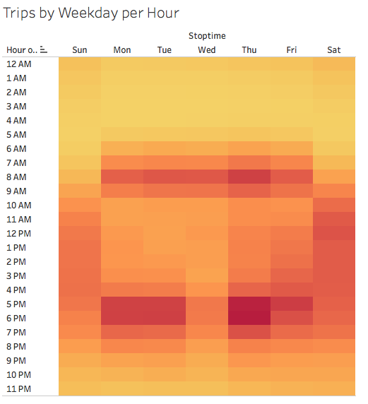

# bikesharing

## Overview
This analysis was performed to support the proposal of starting a bike-sharing program in Des Moines using August 2019 New York City data.

## Results

The tableau dashboard including my analysis can be found here:
[link to dashboard](https://public.tableau.com/profile/megan.lee7189#!/vizhome/NYCCitiBikeStory_16108431407460/BikeTripAnalysis?publish=yes "link to dashboard")

### Checkout Times for Users
This visualization displays that the bikes are checked out for around 4-6 hour durations.

### Checkout Times by Gender
This multiline graph shows that male and females have similar checkout times peaking around 3 hours.

### Trips by Weekday per Hour
Looking at trips by weekday per hour, it appears that there is an influx of trips Mon-Fri from 7-10 am and from 5-7 pm, likely due to rush hour. Thurs and Fri show more trips around mid to late afternoon than the rest of the workweek. The weekends show heavy volume of trips throughout the day from 10 am - 7 pm. 

### Trips by Gender (Weekday Per Hour)
This heatmap confirms that male and females have the same riding pattern, with males at a heavier volume than females indicated by the stronger and more vivid coloration. 

### User Trips by Gender by Weekday
From this breakdown of user trips by gender by weekday, we can takeaway that male subscribers are the most dominant users of Citibikes. 

### Gender Breakdown
This pie chart shows that male users make up more than half of total users at 1.5M, and female users make up only 588K. 

### August Peak Hours
This bar chart shows that the peak hours are 5-6pm followed by the morning rush at 8am and surrounding evening commute times, 4pm and 7pm.  

## Summary
1. Men are the primary users of the bike-sharing program in NYC. The proportion and volume of trips taken by men are far more than women.
2. The bikes are highly used during commute hours around 5-6pm during the weekdays and are an important means of transportation for workers in NYC. 

The two additional visualizations I would perform given the dataset are:
1. I think focusing more on age groups would be insightful similar to how we analyzed deeper for gender, which would include checkout times by age, trips by age, and user trips by age by weekday. 
2. Since we were able to understand the highest number of trip during the day, to take it a step further, it could be interesting to look into the specific start and end locations with the highest volume and determine if there are sufficient or insufficient # of bikes there that could impact trips. 
